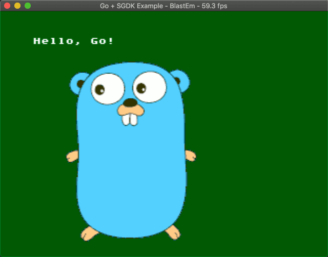

## Go SGDK Sample Project



I spent too long making this, but it works sort of.
It's a simple Mega Drive (SGDK) program written in Go (and assembly).

### How to build this

**2020 UPDATE: I've dropped support for building Go in Marsdev. This will not work.
If for whatever reason you really want to try using Go on MegaDrive bug me via email
or find me on Discord somewhere. I'll share what details I can remember.**

1. Go grab [marsdev](github.com/andwn/marsdev)
2. Build marsdev with `make m68k-toolchain-newlib z80-tools sgdk LANGS=c,go`
3. Clone this repo and `make`

It's working for me at the moment on macOS but haven't been able to test elsewhere yet.

### Quick write up / rambling

This uses gccgo, because GCC has a m68k backend.
Unfortunately it is not possible to build the Go runtime/libraries
for a freestanding environment (such as a MegaDrive game).
Without the runtime most of the language features are unusable.
Basic flow control, packages, and arithmetic seem to work no problem at least.
Someone would have to take the time and effort of porting parts of the Go 
runtime for arrays, slices, types, interfaces etc to work properly.

CGO didn't like it when I tried to use it with libmd.
I think it may also require the runtime. So instead, something a bit weird:

vdp.go

```go
// Wraps VDP_drawText
func DrawText(string, uint16, uint16)
```

vdp_a.s

```
* Need this .globl directive so the linker can find us
    .globl go.vdp.DrawText
go.vdp.DrawText:
* Go passes strings as two parameters, the address and the length
* To work around this move x and y up the stack, overwriting the length
    move.l 12(sp),8(sp)
    move.l 16(sp),12(sp)
* Just jump to it
    jmp VDP_drawText
```

Something similar can be done to get resources built with rescomp:

res.go

```go
// Returns addresses to resource data
func Gopher() uint32
```

res_a.s

```
    .globl go.res.Gopher
go.res.Gopher:
* IMG_Gopher is an Image struct generated by rescomp
* Toss the address in d0 (the return value)
    move.l  #IMG_Gopher,d0
    rts
```

It would be nice to be able to have Image, TileSet, Palette etc as Go types,
however the compiler crashes when using the type keyword.

So yeah things are kind of jank. If someone (not me) ported a subset of
the go runtime for freestanding systems (or at least limited to newlib),
maybe we'd see a couple MD games written in Go in the future.
